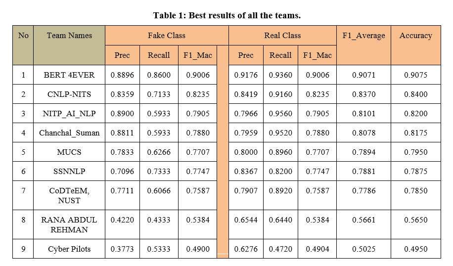

# The 12th meeting of Forum for Information Retrieval Evaluation 2020 ([FIRE-2020](http://fire.irsi.res.in/fire/2020/home))

## Task: [Fake News Detection in the Urdu Language ](https://www.urdufake2020.cicling.org/)
The dissemination of Fake news always beat out the truth with significant growth. Fake news and false rumors are spreading further and faster, reaching more people, and penetrating deeper into social networks. We propose the task titled “Fake News Detection in the Urdu Language", which aims at identifying deceiving news articles in the Urdu language spread via digital media. Urdu fake news detection has been investigated (Amjad al.,2020), and we want better results at the level of English language and more methods. The objective of organizing this task is to address the problem of detecting deceiving information in Urdu language using digital media text.

### Dataset

### Models

### Results

### Citation


### Reference
[Urdu Word Embeddings](http://www.lrec-conf.org/proceedings/lrec2018/pdf/148.pdf)
```

@InProceedings{HAIDER18.148,
  author = {Samar Haider},
  title = {Urdu Word Embeddings},
  booktitle = {Proceedings of the Eleventh International Conference on Language Resources and Evaluation (LREC 2018)},
  year = {2018},
  month = {may},
  date = {7-12},
  location = {Miyazaki, Japan},
  editor = {Nicoletta Calzolari (Conference chair) and Khalid Choukri and Christopher Cieri and Thierry Declerck and Sara Goggi and Koiti Hasida and Hitoshi Isahara and Bente Maegaard and Joseph Mariani and Hélène Mazo and Asuncion Moreno and Jan Odijk and Stelios Piperidis and Takenobu Tokunaga},
  publisher = {European Language Resources Association (ELRA)},
  address = {Paris, France},
  isbn = {979-10-95546-00-9},
  language = {english}
  }
```

### Leaderboard

